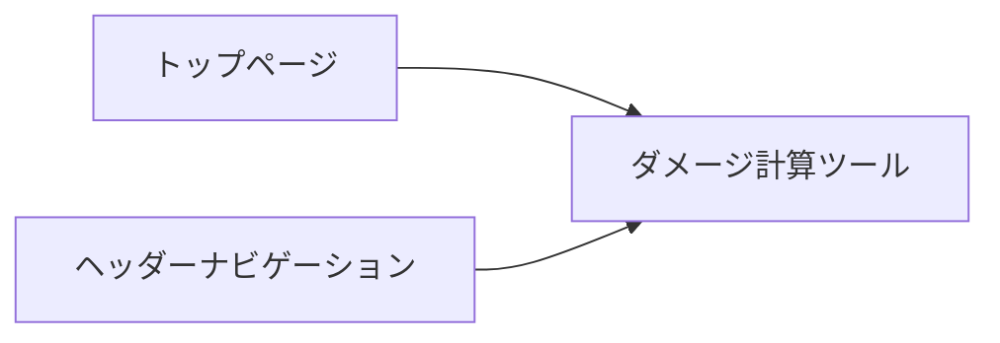

# テンキーでできるダメージ計算ツール基本設計書

## 1. 画面遷移図

本機能は単一ページで完結する機能である。



- **URLパス**: `/tools/damage-calculation`
- **配置**: `web/app/tools/damage-calculation/page.tsx`

## 2. 画面レイアウト設計

画面は大きく分けて **ヘッダー**、**Inputエリア**、**Outputエリア** の3部構成となる。

### 2.1. 全体レイアウト (PC/Tablet/Mobile)
レスポンシブデザインを採用し、画面幅に応じてレイアウトを調整する。

- **PC/タブレット (横)**:
    - Inputエリアを上段、Outputエリアを下段（または左右分割も検討可能だが、要件のInput1行を重視し上下配置を基本とする）。
- **スマホ/タブレット (縦)**:
    - 全てを縦積みに配置。Inputエリアの各項目は適切に折り返しを行う。

### 2.2. Inputエリア (Component: `DamageInputArea`)
要件に従い、以下の配置とする。

```
[威力] [攻撃実数値] [防御実数値] [HP] [タイプ相性(Radio Group)]
          [攻ランク]   [防ランク]
```

- 「威力」〜「タイプ相性」はPC表示時とタブレット縦表示時に可能な限り横一列に配置する。
- 「ランク」入力はそれぞれの「実数値」の下に関連付けて配置する。

### 2.3. Outputエリア (Component: `DamageOutputArea`)
計算結果のマトリクスを表示する。

- **タブ切り替え等ではなく、一覧性を重視して表形式で表示する。**
- **テーブル構造**:
    - Sticky Headerを採用し、縦にスクロールしても列見出し（シングル/ダブル等）が見えるようにする。
    - **行の開閉**: 「タイプ一致」などの行をクリックすると、配下の「1.1倍〜2.0倍」の詳細行がアコーディオン形式で展開される。

## 3. コンポーネント分割案

Atomic Designをベースに、以下のようにコンポーネントを分割する。
既存のコンポーネントがある場合は再利用する。

### 3.1. Page / Templates
- **`ToolsDamageCalculationPage`**: ページ全体のレイアウト責務。状態管理（Input値）を行い、Input/OutputコンポーネントにPropsを渡す。

### 3.2. Organisms
- **`DamageInputForm`**: Inputエリア全体をまとめる。内部で `NumberInput`, `RankSelector`, `TypeEffectivenessSelector` を組み合わせる。
- **`DamageResultTable`**: Outputエリア全体をまとめる。計算結果を受け取り、表を描画する。

### 3.3. Molecules
- **`CalcularableNumberInput`**: 計算機能付き数値入力フィールド。「威力」「実数値」などで使用。
    - 内包する機能: 四則演算パース、↑↓キーハンドリング、フォーカス制御。
- **`RankInput`**: -6〜+6のランクを選択・表示するUI。
- **`TypeEffectivenessSelector`**: タイプ相性（0.25〜4.0）を選択するボタングループ。
- **`DamageResultRow`**: 結果テーブルの各行（アコーディオン親行）。
- **`DamageDetailRow`**: 結果テーブルの詳細行（アコーディオン子行）。

### 3.4. Atoms
- **`InputBase`**: 基本的なInputデザイン。
- **`Button`**: 汎用ボタン。
- **`Badge`**: 確定数（確1、確2など）を表示するためのバッジ。

## 4. データフロー設計

```mermaid
flowchart TD
    User[ユーザー操作] --> |入力/キー操作| PageState[Page状態 (useState/useReducer)]
    PageState --> |Input Props| InputArea[DamageInputForm]
    PageState --> |計算実行| Logic[calculateDamage関数]
    Logic --> |Result Object| OutputArea[DamageResultTable]
    
    subgraph Logic Layer
        CalcLogic[ダメージ計算ロジック]
        (pokemon-damage-calculation-definition.md準拠)
    end
```

- **状態管理**: 入力値はページレベル（または専用フック）で一元管理し、変更があるたびに再計算ロジックを呼び出す。
